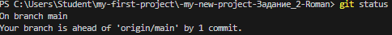
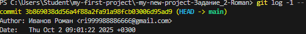

# Инструкция по настройке командной работы в GitHub
## Задание
Приобрести навыки командной работы с репозиторием проекта, технологией Git, средой разработки VS Code (Windows 11), сервисом GitHub.com

## Команда
Тимлид - создает основной репозиторий и управляет процессом
Падаван - участник команды, вносит изменения через форк
Преподаватель - наблюдает и проверяет процесс
## Необходимые данные для начала работы
Перед началом работы необходимо собрать следующую информацию:

## Общие данные
Название основного репозитория: Task002
Описание проекта: Общий проект студентов группы
## Данные участников
Тимлид:

Логин на GitHub: ri999988886666
Полный путь к локальной папке проекта: C:\Users\Student\my-first-project\-my-new-project-Задание_2-Roman
Падаван:

Логин на GitHub: ri999988886666
Полный путь к локальной папке проекта: C:\Users\Student\my-first-project\-my-new-project-Задание_2-Roman
Преподаватель:

Логин на GitHub: Teacher001-top
## Краткий план - пошаговая инструкция
Подготовка - Тимлид создает основной репозиторий
Форкирование - Падаван создает форк основного репозитория
Клонирование - Оба участника клонируют репозитории на локальные машины
Настройка связей - Настройка upstream для синхронизации
Рабочий процесс - Создание ветки, внесение изменений, коммит, пуш
Pull Request - Создание и проверка запроса на включение изменений
Слияние - Тимлид принимает изменения в основной репозиторий
## Подробная инструкция
## Шаг 1: Создание основного репозитория (Тимлид)
Вводная часть: Тимлид создает центральный репозиторий проекта, который будет основой для совместной работы.

Как выполнять:

Авторизоваться на GitHub.com под учетной записью тимлида
Создать новый репозиторий
Настроить базовые параметры
Подтвердить создание
Действия:

Действие 1.1: Перейти на GitHub.com и войти в систему

Команда: Логин на GitHub.com → Ввод логина/пароля
Действие 1.2: Создать новый репозиторий

Команда: Клик на "+" в правом верхнем углу → "New repository"
Действие 1.3: Заполнить параметры репозитория

Настройка:
Repository name: [название репозитория]
Description: [описание проекта]
Public/Private: Public
✓ Initialize this repository with a README
Действие 1.4: Создать репозиторий

Команда: Клик "Create repository"
Типовые ошибки:

Ошибка: Не создан README.md

Идентификация: Репозиторий создан пустым
Исправление: Перейти в репозиторий → "Add file" → "Create new file" → создать README.md
Ошибка: Репозиторий создан как Private

Идентификация: Падаван не видит репозиторий
Исправление: Settings → Danger Zone → Change visibility → Make public
Штатный результат: Создан основной репозиторий с README.md по адресу: https://github.com/[логин_тимлида]/[название_репозитория]

## Шаг 2: Создание форка (Падаван)
Вводная часть: Падаван создает свою копию основного репозитория для внесения изменений.

Как выполнять:

Перейти на страницу основного репозитория
Создать форк
Проверить создание форка
Действия:

Действие 2.1: Перейти к основному репозиторию

Команда: Переход по ссылке: https://github.com/ri999988886666-pixel/Task2-Roman
Действие 2.2: Создать форк

Команда: Клик кнопки "Fork" в правом верхнем углу
Действие 2.3: Выбрать аккаунт для форка

Команда: Выбрать аккаунт падавана из списка
Типовые ошибки:

Ошибка: Кнопка "Fork" неактивна
Идентификация: Нет прав на просмотр репозитория
Исправление: Проверить, что репозиторий Public, или записать доступ у тимлида
Штатный результат: Создан форк по адресу: https://github.com/ri999988886666-pixel/Task2-Roman с пометкой "forked from [логин_тимлида]/[название_репозитория]"

## Шаг 3: Клонирование репозиториев на локальные машины
Вводная часть: Участники клонируют репозитории на свои компьютеры для локальной работы.

#### Действия для Тимлида
Действия:

Действие 3.1 (Тимлид): Открыть терминал в VS Code

Команда: Terminal → New Terminal
Действие 3.2 (Тимлид): Перейти в рабочую директорию

Команда: cd [путь_к_локальной_папке_тимлида]
Действие 3.3 (Тимлид): Клонировать основной репозиторий

Команда: git clone https://github.com/[логин_тимлида]/[название_репозитория].git
Действия для Падавана
Действия:

Действие 3.4 (Падаван): Перейти в рабочую директорию

Команда: cd [путь_к_локальной_папке_падавана]
Действие 3.5 (Падаван): Клонировать свой форк

Команда: git clone https://github.com/[логин_падавана]/[название_репозитория].git
Типовые ошибки:

Ошибка: "fatal: destination path already exists"

Идентификация: Папка с таким именем уже существует
Исправление: Удалить существующую папку или использовать другое имя
Ошибка: "Authentication failed"

Идентификация: Неверные учетные данные GitHub
Исправление: Проверить логин/пароль или настроить SSH-ключи
Штатный результат: Локальные копии репозиториев созданы в указанных папках

### Шаг 4: Настройка связей между репозиториями
Вводная часть: Настройка связи для синхронизации изменений между форком и основным репозиторием.

#### Действия для Падавана
Действия:

Действие 4.1: Перейти в папку проекта

Команда: cd [название_репозитория]
Действие 4.2: Проверить текущие remote-связи

Команда: git remote -v
Действие 4.3: Добавить связь с основным репозиторием

Команда: git remote add upstream https://github.com/[логин_тимлида]/[название_репозитория].git
Действие 4.4: Проверить добавленную связь

Команда: git remote -v
Типовые ошибки:

Ошибка: "remote upstream already exists"
Идентификация: Связь уже настроена
Исправление: Пропустить шаг или обновить ссылку: git remote set-url upstream [новая_ссылка]
Штатный результат: В выводе git remote -v видны две связи: origin (форк) и upstream (основной репозиторий)

### Шаг 5: Рабочий процесс - внесение изменений
Вводная часть: Стандартный цикл работы над задачей: создание ветки, внесение изменений, коммит.

Действия:

Действие 5.1: Обновить локальную main ветку

Команда:
git checkout main
git fetch upstream
git merge upstream/main
Действие 5.2: Создать новую ветку для задачи

Команда: git checkout -b feature/add-new-file
Действие 5.3: Создать или изменить файлы в VS Code

Команда: Создать новый файл через Explorer VS Code
Действие 5.4: Проверить статус изменений

Команда: git status
Действие 5.5: Добавить изменения в индекс

Команда: git add .
Действие 5.6: Создать коммит

Команда: git commit -m "Добавлен новый функционал"
Типовые ошибки:

Ошибка: Работа в main ветке без создания feature-ветки
Идентификация: git status показывает изменения в main
Исправление: Создать новую ветку и перенести изменения
Штатный результат: Создана новая ветка с коммитом изменений

### Шаг 6: Отправка изменений и создание Pull Request
Вводная часть: Отправка изменений в форк и создание запроса на включение в основной репозиторий.

Действия:

Действие 6.1: Отправить ветку в форк

Команда: git push origin feature/add-new-file
Действие 6.2: Перейти на GitHub форка падавана

Команда: Открыть браузер → https://github.com/[логин_падавана]/[название_репозитория]
Действие 6.3: Создать Pull Request

Команда: Клик "Compare & pull request"
Действие 6.4: Заполнить информацию PR

Настройка:
Title: Добавлен новый функционал
Description: Описание внесенных изменений
Reviewers: [логин_тимлида]
Типовые ошибки:

Ошибка: Нет кнопки "Compare & pull request"
Идентификация: Ветка не была отправлена или уже есть открытый PR
Исправление: Проверить git push или найти существующий PR
Штатный результат: Создан Pull Request в основном репозитории

### Шаг 7: Проверка и слияние изменений (Тимлид)
Вводная часть: Тимлид проверяет изменения и принимает их в основной репозиторий.

Действия:

Действие 7.1: Перейти к Pull Request в основном репозитории

Команда: Основной репозиторий → вкладка "Pull requests"
Действие 7.2: Просмотреть изменения

Команда: Клик на PR → вкладка "Files changed"
Действие 7.3: Одобрить изменения

Команда: Клик "Review changes" → "Approve"
Действие 7.4: Выполнить слияние

Команда: Клик "Merge pull request" → "Confirm merge"
Типовые ошибки:

Ошибка: Конфликт слияния
Идентификация: GitHub показывает "This branch has conflicts that must be resolved"
Исправление: Падаван должен обновить свою ветку и разрешить конфликты
Штатный результат: Изменения объединены в основной репозиторий, PR закрыт

## Завершение работы
### Финализация для Падавана
Действие: Обновить локальный репозиторий
Команда:
git checkout main
git fetch upstream
git merge upstream/main
Финализация для Тимлида
Действие: Проверить актуальность основного репозитория
Команда: Просмотр основного репозитория на GitHub.com
Контрольные точки проверки
✅ Основной репозиторий создан и доступен
✅ Форк падавана создан правильно
✅ Локальные клоны работают
✅ Связь upstream настроена
✅ Изменения коммитятся в feature-ветки
✅ Pull Request создается корректно
✅ Слияние выполняется без конфликтов
## Дополнительные настройки (опционально)
### Настройка Git в VS Code (первоначальная)
git config --global user.name "Ваше Имя"
git config --global user.email "ваш.email@example.com"
git config --global core.editor "code --wait"
### Игнорирование файлов (.gitignore)
Создать файл .gitignore в корне проекта с содержанием:

node_modules/
.env
.DS_Store
*.log
```# Task001
Инструкция по настройке командной работы в GitHub

# Отчет по командной работе в GitHub

## Основная информация
- **Название проекта:** `Task002`
- **Дата выполнения:** `02.10.2025`
- **Состав команды:** 
  - Тимлид: `ri999988886666`
  - Падаван: `ri999988886666`
  - Преподаватель: `Teacher001-top`

## Ссылки на репозитории
- **Основной репозиторий:** `https://github.com/ri999988886666-pixel/Task2-Roman.git`
- **Форк падавана:** `https://github.com/ri999988886666-pixel/Task2-Roman.git`
- **Pull Request:** `-`

---

## Раздел Тимлида

### 1. Создание и настройка основного репозитория

**Выполненные действия:**
- [+] Создан репозиторий на GitHub.com
- [+] Добавлен README.md файл
- [+] Настроена видимость (Public/Private)
- [+] Проверена доступность репозитория

**Команды выполнения:**
```bash
# Локальная настройка
git config --global user.name "Иавнов  Роман"
git config --global user.email "ri999988886666@gmail.com"

# Клонирование основного репозитория
git clone https://github.com/ri999988886666-pixel/Task2-Roman.git
cd C:\Users\Student\my-first-project\-my-new-project-Задание_2-Roman
Результаты:

URL основного репозитория: https://github.com/ri999988886666-pixel/Task2-Roman.git
Количество начальных файлов: ______
Статус репозитория: [X] Public [ ] Private

Проверка изменений:

 Код соответствует требованиям
 Нет конфликтов слияния
 Коммиты имеют понятные сообщения
 Изменения логичны и завершены
Действия по мержу:

# Проверка перед мержем
git fetch origin
git checkout main
git log --oneline -5
3. Финальное состояние репозитория
После принятия изменений:

Количество файлов: ______
Количество коммитов: ______
Актуальные ветки: ________________
Проверочные команды:

git branch -a
git log --oneline --graph
Раздел Падавана
1. Начальная настройка
Выполненные действия:

 + Создан форк основного репозитория
 + Локально клонирован форк
 + Настроена связь upstream
Команды выполнения:

# Клонирование форка
git clone https://github.com/ri999988886666-pixel/Task2-Roman.git
cd C:\Users\Student\my-first-project\-my-new-project-Задание_2-Roman

# Настройка upstream
git remote add upstream https://github.com/ri999988886666-pixel/Task2-Roman.git (fetch)
Результаты проверки: origin https://github.com/ri999988886666-pixel/Task2-Roman.git (fetch) 
origin https://github.com/ri999988886666-pixel/Task2-Roman.git (push) 
upstream https://github.com/ri999988886666-pixel/Task2-Roman.git (fetch) 
upstream https://github.com/ri999988886666-pixel/Task2-Roman.git (push)

2. Рабочий процесс
Создание feature-ветки:

Имя ветки: main
Цель изменений: Тест
Команды работы:

Создание и переход на новую ветку
git checkout main git fetch upstream git merge upstream/main git checkout -b тест

# Внесение изменений
# ... работа в VS Code ...

# Коммит изменений
git add .
git status
git commit -m "______"
Внесенные изменения:

Созданные файлы: test.txt
Измененные файлы: Нет
Удаленные файлы: Нет
3. Отправка изменений и создание PR
Команды отправки:

git push origin test.txt
Информация Pull Request:

Заголовок PR: Добавлен новый функционал
Описание изменений:нету
Ссылка на PR:
Статус PR:

✅ Создан
 На проверке
 Требуются исправления
 Принят
 Отклонен
Совместные результаты
2. Сравнение состояния репозитория

3. Вклад участников
| Участник | Количество коммитов | Созданные файлы | Внесенные изменения |
|----------|---------------------|-----------------|---------------------|
| Тимлид | 12 | 7 | 3 |
| Падаван | 12 | 7 |3 |

Решение: Принять приглошение
Результат: ✅ Решено ❌ Частично решено ❌ Не решено
Проблема: 403

Решение: перезаход в акаунт
Результат: ✅ Решено ❌ Частично решено ❌ Не решено
Типовые ошибки и их исправление:
Ошибка: Неправильная настройка remote
Как исправили: указал правильный путь
Проверочные тесты
Тест для Тимлида:
 git status показывает "working tree clean"
 git log отображает мерж-коммит от PR
 Все ветки актуальны (git fetch --all)
 На GitHub отображаются все изменения 
 
 
Тест для Падавана:
 git remote -v показывает origin и upstream
 Локальная main ветка синхронизирована с upstream
 PR имеет статус "Merged"
 Локально можно переключиться на обновленную main
Выводы и заключение
Что получилось:
 Организована командная работа
 Освоен процесс Fork-Pull Request
 Выполнена поставленная задача
 Код успешно объединен
Что нужно улучшить:
________________
________________
Общая оценка работы команды: [ ] Отлично [ ] Хорошо [ ] Удовлетворительно
Подписи участников
Тимлид:

GITHUBID: ri999988886666
Подпись: ________________
Дата: 03.10.2025
Падаван:

GITHUBID: ri999988886666
Подпись: ________________
Дата: 03.10.2025
Преподаватель:

GITHUBID: Teacher001-top
Подпись: ________________
Дата: ________________

Оценка: ________________


# Задание [номер]

## Описание задания
[Здесь будет описание конкретного задания]

---
## 📁 Мои репозитории с заданиями

| № | Задание | Ссылка на репозиторий | Текущий |
|---|---------|----------------------|---------|
| 1 | Задание 1 | [Репозиторий 1]() | ⬜ |
| 2 | Задание 2 | [Репозиторий 2](https://github.com/ri999988886666-pixel/Task2-Roman) | ✅ |
| 3 | Задание 3 | [Репозиторий 3]() | ⬜ |
| 4 | Задание 4 | [Репозиторий 4]() | ⬜ |
| 5 | Задание 5 | [Репозиторий 5]() | ⬜ |
| 6 | Задание 6 | [Репозиторий 6]() | ⬜ |

**Примечание:** Галочкой (✅) отмечен текущий репозиторий
